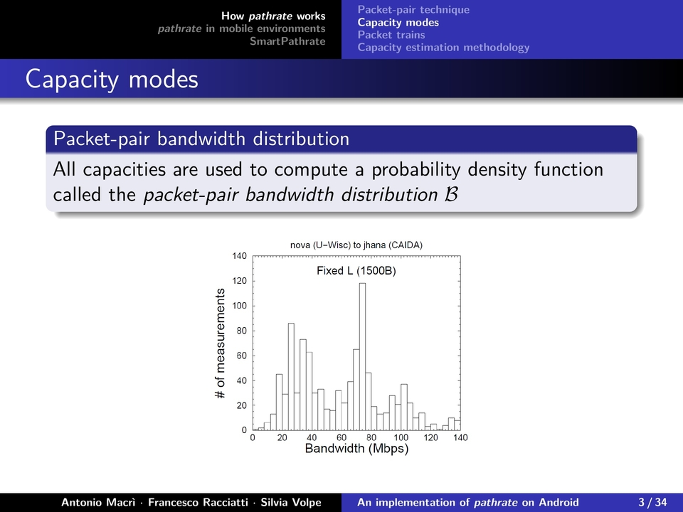
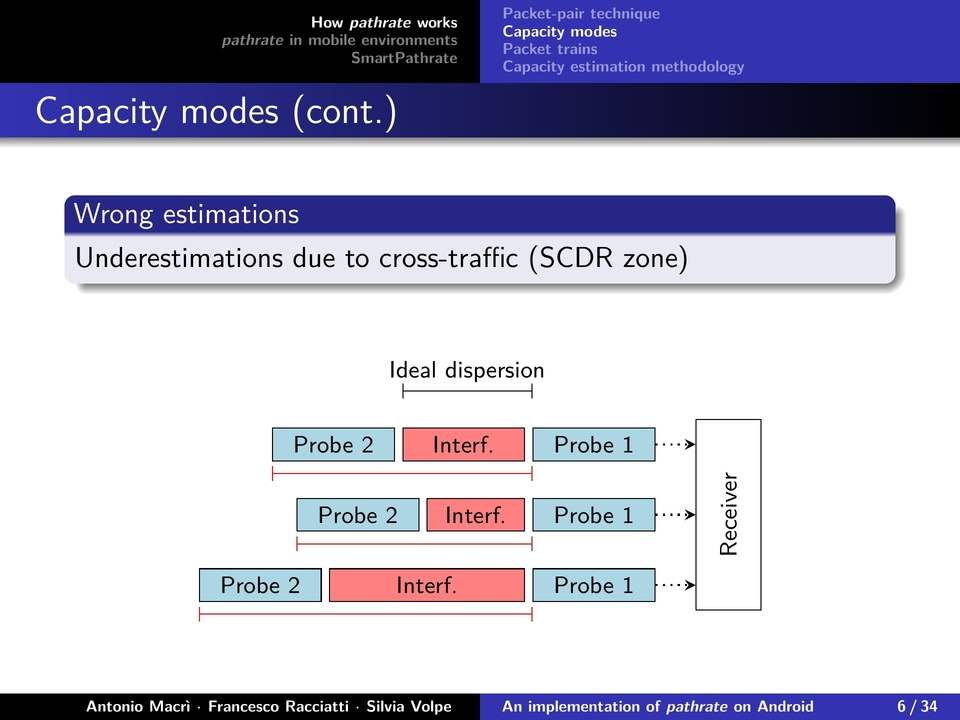
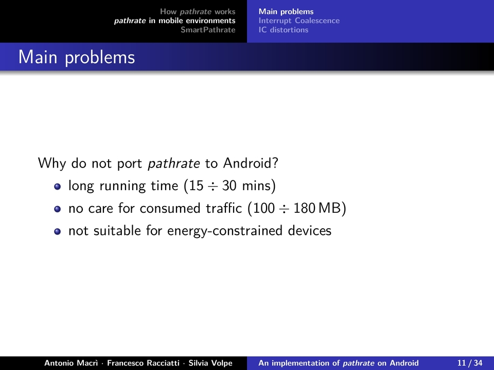

SmartPathrate
=============

An implementation of _pathrate_ for Android.

Academic project, _Architetture Avanzate di Networking e Sistemi Wireless_ (AANSW), Laurea Magistrale in Ingegneria Informatica, Università di Pisa.

Presentation
------------

